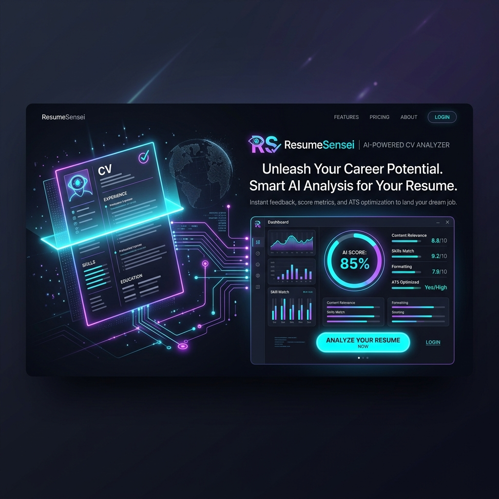
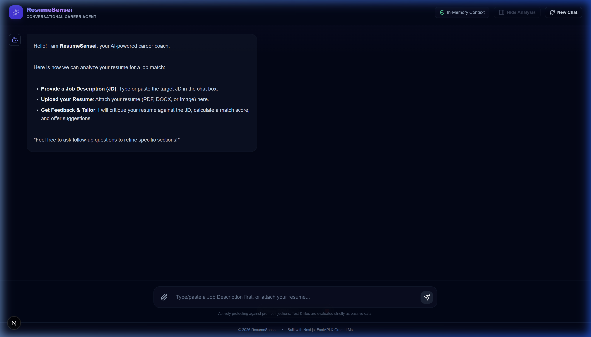
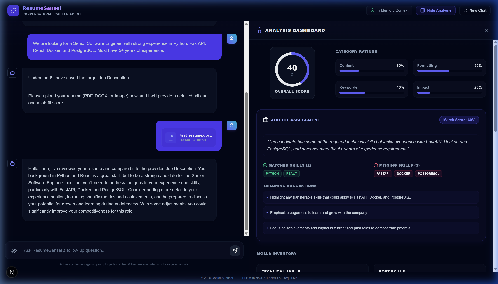
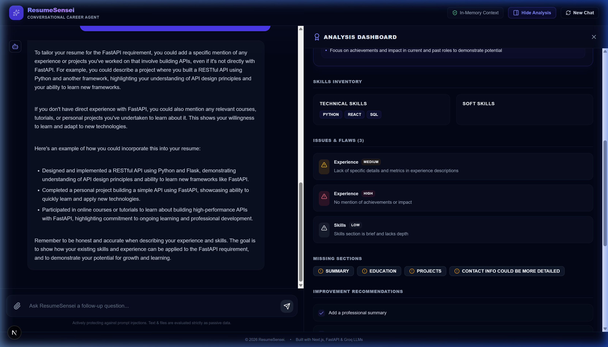

<div align="center">
  

  # 🎓 ResumeSensei
  <h3>AI-Powered Conversational Resume Analyser & Job Matching Agent</h3>

  <p align="center">
    
    
    
    
  </p>

  <br />
  
  <h3>✨ See It In Action (WebP Demo) ✨</h3>
  
</div>

<br />

---

ResumeSensei is an interactive, conversational web application designed to help job seekers critique and tailor their resumes against specific Job Descriptions (JDs). Powered by Groq's high-speed inference engine, the app conducts deep text parsing and image-based scanned PDF/OCR analysis to generate structured scores, match insights, and bullet rewrites side-by-side with an AI career coach chat window.

---

## 🚀 Key Features

* **Dual-Pane Interactive UI**: Chat with ResumeSensei on the left, and view the structured analysis dashboard on the right.
* **Conversational Context Retention**: ResumeSensei remembers your target Job Description, uploaded resume text, and prior analyses for follow-up questions (e.g., *"How can I improve my projects section for this?"*).
* **Multi-Format Parsing**:
  * **Text Resumes**: Parses text from clean PDFs and DOCX files.
  * **Scanned Resumes**: Converts scanned/image-only PDFs and images (PNG, JPG, JPEG) to images, processing them via Groq's multimodal vision engine.
* **Deep Match Analysis**:
  * **Category Scores**: Content strength, formatting, keyword alignment, and impact/metric ratings.
  * **Skills Inventory**: Segmented list of technical and soft skills, plus green matched and red missing chips against the Job Description.
  * **Flaws & Issues Identification**: Severity-coded warnings highlighting weak sections, structural errors, or lack of metrics.
  * **Actionable Bullet Point Rewrites**: Side-by-side comparison of original bullet points with tailored, metric-driven *Task-Action-Result* (STAR) versions.
* **In-Memory & Privacy-First**: Resumes are processed in-memory and are never stored in a database. Sessions are cleared upon request or after inactivity.

---

## 📸 Visual Interface Tour

Here is a visual walkthrough of the ResumeSensei experience:

### 💡 1. Welcome Screen & Workspace Initialization
When you open the app, you are greeted by the clean, minimal workspace. The assistant explains how to paste a Job Description and attach your resume.
<p align="center">
  
</p>

### 📊 2. Side-by-Side Analysis Dashboard
Upon uploading your resume, the dashboard slides into view on the right, providing an interactive, visual breakdown of your scores, issues, missing sections, and checklist items.
<p align="center">
  
</p>

### 💬 3. Context-Aware Follow-up QA
Ask any follow-up questions. ResumeSensei references the saved JD, resume details, and prior scores, guiding you step-by-step to improve specific bullet points.
<p align="center">
  
</p>

---

## 🛠️ Project Structure

```
├── backend/                  # FastAPI Backend API
│   ├── .env                  # Environment Variables (API Keys, Ports)
│   ├── main.py               # Main API endpoints (CORS, Chat, Session Reset)
│   ├── analyzer.py           # Groq API integration (llama-3.3-70b-versatile, qwen/qwen3.6-27b)
│   ├── parser.py             # PDF/DOCX parsing and scanned page conversion
│   └── requirements.txt      # Python dependencies
└── frontend/                 # Next.js Frontend App
    ├── src/app/
    │   ├── page.tsx          # Dual-pane conversational Home page
    │   ├── globals.css       # Tailwind CSS configurations
    │   └── layout.tsx        # App layout and custom fonts
    └── package.json          # Node.js dependencies
```

---

## 💻 Installation & Local Setup

### Prerequisite
* Python 3.10+
* Node.js 18+
* Groq API Key (added to `.env`)

### 1. Backend Setup
1. Open a terminal and navigate to the backend folder:
   ```bash
   cd backend
   ```
2. Create and activate a virtual environment:
   ```bash
   python -m venv .venv
   # On Windows (PowerShell):
   .\.venv\Scripts\Activate.ps1
   # On macOS/Linux:
   source .venv/bin/activate
   ```
3. Install dependencies:
   ```bash
   pip install -r requirements.txt
   ```
4. Create a `.env` file from `.env.example` and add your `GROQ_API_KEY`:
   ```env
   GROQ_API_KEY=your_groq_api_key_here
   GROQ_VISION_MODEL=qwen/qwen3.6-27b
   PORT=8000
   HOST=127.0.0.1
   ```
5. Start the backend server:
   ```bash
   python -m uvicorn main:app --host 127.0.0.1 --port 8000 --reload
   ```

### 2. Frontend Setup
1. Open another terminal and navigate to the frontend folder:
   ```bash
   cd frontend
   ```
2. Install npm dependencies:
   ```bash
   npm install
   ```
3. Run the development server:
   ```bash
   npm run dev
   ```
4. Open [http://localhost:3000](http://localhost:3000) in your browser.

---

## 🌿 How to Push Changes and Open a GitHub PR

Follow these standard steps to push your local code and create a Pull Request on GitHub:

### 1. Check Local Git Status
Ensure you are in the project root directory and check which files have been modified:
```bash
git status
```

### 2. Create a New Feature Branch
It is best practice to keep the `main` branch clean and work in a separate feature branch:
```bash
git checkout -b feature/groq-chat-integration
```

### 3. Stage and Commit Your Changes
Add the modified files to Git and commit with a clean, descriptive message:
```bash
# Add files (stage them)
git add .

# Verify staged changes
git status

# Commit changes
git commit -m "feat: implement Phase 2 conversational chat and Groq API integration"
```

### 4. Push the Branch to GitHub
Push your local branch to your remote repository on GitHub:
```bash
# Push branch and set upstream tracking
git push -u origin feature/groq-chat-integration
```

### 5. Create a Pull Request (PR)
1. Open your web browser and go to your repository page on GitHub.
2. You will see a banner saying: **"feature/groq-chat-integration had recent pushes less than a minute ago"**.
3. Click the green **"Compare & pull request"** button.
4. Add a title (e.g., `feat: Phase 2 Groq API and Conversational Dashboard`) and a description of your changes.
5. Click **"Create pull request"**.
6. Review the code changes, wait for automated checks, and merge it when approved!

---

## 📬 Contact & Developer Info

If you have any questions, suggestions, or want to connect, feel free to reach out:

* **📧 Email**: [dharmrajv532@gmail.com](mailto:dharmrajv532@gmail.com)
* **🔗 LinkedIn**: [Dharmraj Verma](https://www.linkedin.com/in/dharmraj-verma-9223a2423?utm_source=share_via&utm_content=profile&utm_medium=member_android)

